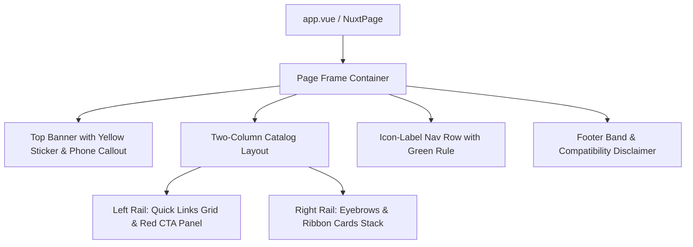

# Dell 1996 Redesign Design

**Spec**: `.specs/features/dell-1996-redesign/spec.md`
**Status**: Approved

---

## Architecture Overview

The application is built on Nuxt 3 with Vue 3 and TailwindCSS. The redesign transforms the single-page layout into a period-accurate 1996 Dell catalog web experience. 



---

## Code Reuse Analysis

### Existing Components to Leverage

| Component | Location | How to Use |
| --- | --- | --- |
| Icon Component | `nuxt-icon` | Render social icons & vintage UI glyphs |
| Tailwind Pipeline | `tailwind.config.js`, `assets/css/main.css` | Extend theme tokens for Dell 1996 colors, typography, and utility classes |
| Existing Portfolio Content | `pages/index.vue` | Extract Leonardo's bio, links, and projects into structured data models |

### Integration Points

| System | Integration Method |
| --- | --- |
| Nuxt 3 Engine | Page routing via `pages/index.vue` and global styles in `assets/css/main.css` |
| Tailwind Theme | Custom color tokens and font families in `tailwind.config.js` |

---

## Components

### 1. `VintagePageFrame` (Layout Shell)
- **Purpose**: Encloses the entire page inside an authentic solid black outer border (8px desktop, 4px tablet, 2px mobile).
- **Location**: `components/vintage/VintagePageFrame.vue`
- **Interfaces**: Slots (`default`)
- **Dependencies**: Tailwind classes

### 2. `VintageBanner`
- **Purpose**: Displays the top black strip with "LEONARDO NADIN. FULL STACK DEVELOPER.", yellow "BUY a NADIN" sticker, and red contact callout.
- **Location**: `components/vintage/VintageBanner.vue`
- **Interfaces**: Props (`title: string`, `subtitle: string`, `phoneOrContact: string`)
- **Dependencies**: Tailwind typography & colors

### 3. `VintageCtaBlock`
- **Purpose**: Vivid Dell-red CTA panel with white Times New Roman copy and 1px black border.
- **Location**: `components/vintage/VintageCtaBlock.vue`
- **Interfaces**: Props (`headline: string`, `body: string`)
- **Dependencies**: Tailwind colors (`colors.primary`)

### 4. `VintageRibbonCard`
- **Purpose**: Product-row style ribbon card consisting of white Helvetica title bar and tinted color-block body with optional sticker.
- **Location**: `components/vintage/VintageRibbonCard.vue`
- **Interfaces**: Props (`title: string`, `subtitle?: string`, `description: string`, `url: string`, `tint: string`, `badgeText?: string`)
- **Dependencies**: Tailwind vintage tint color classes

### 5. `VintageFooter`
- **Purpose**: Bottom icon-label navigation bar and browser compatibility disclaimer.
- **Location**: `components/vintage/VintageFooter.vue`
- **Interfaces**: Props (`links: Array<{ label: string, icon: string, url: string }>`)
- **Dependencies**: `nuxt-icon`

---

## Data Models

```typescript
export interface ProjectItem {
  id: string;
  title: string;
  subtitle?: string;
  description: string;
  url: string;
  tint: 'sage' | 'salmon' | 'peach' | 'lime' | 'sky' | 'steel' | 'periwinkle' | 'olive';
  badge?: string;
}

export interface SocialLink {
  name: string;
  label: string;
  url: string;
  icon: string;
}
```

---

## Error Handling Strategy

| Error Scenario | Handling | User Impact |
| --- | --- | --- |
| Missing project URL | Render card without active hyperlink | Information is visible without dead link |
| Screen width < 480px | Collapse multi-column elements to 100% width and reduce frame width | Clean mobile readability without horizontal overflow |

---

## Risks & Concerns

| Concern | Location (file:line) | Impact | Mitigation |
| --- | --- | --- | --- |
| Font availability for Arial Black / Times New Roman | `assets/css/main.css:1` | Browser fallbacks might alter line-height | Define explicit OS system font stacks matching DESIGN.md |

---

## Tech Decisions

| Decision | Choice | Rationale |
| --- | --- | --- |
| Color & Typography tokens | Extend `tailwind.config.js` with exact 1996 hex codes and font families | Enables idiomatic Vue/Tailwind classes while preserving exact DESIGN.md specifications |
| Single Page Architecture | Keep `pages/index.vue` with modular Vue components | Minimal overhead, fast loading, direct alignment with static portfolio requirement |
